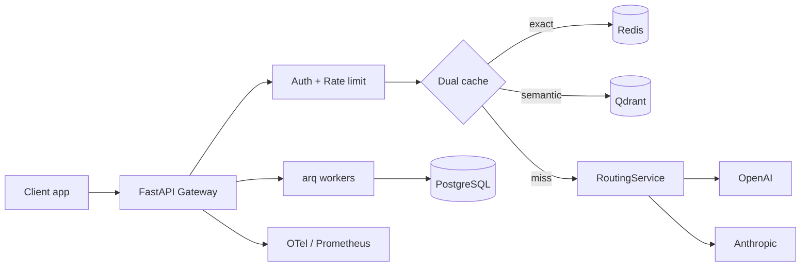

# LLMOps Gateway & Observability Platform

**Async multi-tenant LLM gateway** — dual-layer semantic caching, OpenAI/Anthropic failover, per-request cost & tracing, API-key auth, rate limiting. **127+ tests**, Dockerized, arq workers.

[](docs/RELEASE_v1.0.0-beta.1.md)

## At a glance



| Capability | Details |
|------------|---------|
| **Caching** | Redis exact-match + Qdrant semantic (cosine ≥ 0.95), tenant-scoped |
| **Resilience** | Circuit breakers, backoff, cross-provider fallback |
| **Security** | Peppered API keys, scopes, per-tenant token-bucket limits |
| **Observability** | Traces, token usage, cost attribution → Postgres + OTel |
| **Ops** | Readiness probes, migrate-on-start, admin APIs |

## Documentation

| Doc | Purpose |
|-----|---------|
| [ARCHITECTURE.md](docs/ARCHITECTURE.md) | Full technical reference (Phases 1–8) |
| [DEMO.md](docs/DEMO.md) | Record a 2-minute recruiter demo |
| [DESIGN_DECISIONS.md](docs/DESIGN_DECISIONS.md) | ADRs + interview Q&A |
| [RESUME_BULLETS.md](docs/RESUME_BULLETS.md) | Resume & LinkedIn copy |
| [BENCHMARKS.md](docs/BENCHMARKS.md) | Performance numbers (run locally) |
| [PRODUCTION_ROADMAP.md](docs/PRODUCTION_ROADMAP.md) | Honest gaps & next steps |
| [RELEASE_v1.0.0-beta.1.md](docs/RELEASE_v1.0.0-beta.1.md) | Release notes |

## Architectural Pillars

1. **Asynchronous Gateway Engine** — non-blocking FastAPI core, pooled connections, dynamic provider fallback, automatic retry under 429s.
2. **Dual-Layer Semantic Caching** — Redis for exact-match, Qdrant for cosine-similarity semantic matching (threshold-gated, pluggable embedding backend).
3. **Observability, Cost Tracking & Tracing** — async span capture (tokens, pricing, latency) exported via OpenTelemetry/Langfuse-compatible pipelines, without blocking the request path.

## Stack

- **API:** FastAPI (async), Pydantic v2
- **Cache:** Redis (exact match) + Qdrant (semantic match)
- **Database:** PostgreSQL via async SQLAlchemy 2.0 + Alembic
- **Background jobs:** arq (Redis-backed)
- **Observability:** OpenTelemetry SDK + OTLP exporter, Prometheus, Grafana
- **Embeddings:** pluggable — local `sentence-transformers` (default) or an external embedding API

## Project Layout

```
src/llmops_gateway/
├── api/            # FastAPI routers (thin — delegate to services/)
├── domain/         # Entities, value objects, and interfaces (framework-free)
├── services/       # Use-case orchestration (GatewayService, CacheService, ...)
├── providers/      # LLMProvider adapters (OpenAI, Anthropic) + fallback registry
├── embeddings/     # Pluggable EmbeddingProvider (local + API)
├── caching/        # Redis exact-cache + Qdrant semantic-cache implementations
├── middleware/      # Auth, rate limiting, request context, error handling
├── observability/  # OTel setup, Langfuse exporter, Prometheus metrics
├── persistence/    # SQLAlchemy models + repositories
├── workers/        # arq background job definitions
└── clients/        # Shared pooled clients (Redis, Qdrant, httpx)
```

## Getting Started

```bash
cp .env.example .env          # fill in OPENAI_API_KEY / ANTHROPIC_API_KEY
make install                  # pip install -e ".[dev]"
make up                       # start full stack (infra + gateway + worker)
make up-infra                 # infra only (postgres, redis, qdrant, observability)
make migrate                  # apply Alembic migrations
make dev                      # run the API with autoreload on :8000
make worker                   # in a second terminal: run the arq background worker
```

Run the test suite:

```bash
make test
```

## Demo (5 minutes)

```bash
make up
make demo          # health, auth, cache miss/hit, rate limit
```

Walkthrough for recording: [docs/DEMO.md](docs/DEMO.md). Dev API key: `llmops_dev_default_key` (`X-API-Key` header).

## Benchmarks

Run against a live stack with provider keys configured:

```bash
make benchmark     # or: python scripts/benchmark_gateway.py --requests 20
```

Paste results into [docs/BENCHMARKS.md](docs/BENCHMARKS.md) and [RESUME_BULLETS.md](docs/RESUME_BULLETS.md).

| Metric | Value |
|--------|-------|
| Requests | _run `make benchmark`_ |
| Cache hit ratio | _run benchmark_ |
| Latency p50 / p95 | _run benchmark_ |
| Environment | local Docker, `gpt-4o-mini` |

## Status

- **Phase 1 — Scaffold:** directory structure, domain interfaces, config, Docker Compose infra, and API/service/module skeletons.
- **Phase 2 — Provider Adapters:** OpenAI + Anthropic adapters with unified request/response mapping (streaming + non-streaming), exponential backoff with a per-provider circuit breaker, and automatic cross-provider fallback routing (`services/routing_service.py`).
- **Phase 3 — Cache Layer:** dual-layer caching fully wired into `GatewayService`, intercepting requests before they ever reach the provider layer:
  - **Layer 1 (Redis exact-match)** — `caching/redis_exact_cache.py`, fails closed on any Redis error.
  - **Layer 2 (Qdrant semantic-match)** — `caching/qdrant_semantic_cache.py`, cosine-similarity search filtered by tenant/model/params, collection auto-bootstrapped per embedding model.
  - **Embeddings** — `embeddings/local_provider.py` (in-process `sentence-transformers`, eagerly warmed up at startup) as the default, pluggable to an API-based provider via `EMBEDDING_PROVIDER=api`.
  - **Request coalescing** (`services/cache_service.py`) collapses concurrent identical cache-miss requests onto a single upstream call via a short-TTL Redis lock.

- **Phase 4 — Observability, Cost Tracking & Tracing:**
  - **Cost tracking** (`services/cost_service.py`) — versioned `model_pricing` lookups (Postgres, via `persistence/repositories/pricing_repository.py`), Redis-cached with a short TTL so pricing changes are a data update, not a deploy. Cache hits always report `cost_usd=0` (no new spend incurred); cache misses stamp the real computed cost onto both the response and the cached entry.
  - **Tracing** (`services/tracing_service.py`) — `GatewayService` now wraps `cache_lookup` / `upstream_call` / `cost_calculation` in spans; `flush()` persists the request + spans + token usage to Postgres and exports the same spans to every configured `TraceExporter`, all as a fire-and-forget task off the response path.
  - **OpenTelemetry** (`observability/otel_setup.py`, `observability/otel_trace_exporter.py`) — a real `TracerProvider` + batched OTLP exporter, with our own spans bridged onto genuine OTel spans (parent/child relationships preserved) rather than just logged.
  - **Langfuse** (`observability/langfuse_exporter.py`) — best-effort batch-ingestion exporter, enabled via `LANGFUSE_ENABLED=true` + keys.
  - **Prometheus metrics** (`observability/metrics.py`) are now actually recorded on every response (latency histogram, cache-hit ratio, provider call counts, cumulative cost).
  - `X-Trace-Id` / `X-Cache-Status` / `X-Request-Cost` response headers on non-streaming completions; a trailing usage/cost SSE event on streamed ones.
  - Hand-written Alembic migrations (`migrations/versions/0001_initial_schema.py`, `0002_seed_defaults.py`, `0003_seed_dev_api_key.py`) create the full schema and seed a default tenant + illustrative pricing rows + a development API key.

- **Phase 5 — Middleware & Security:**
  - **API-key hashing** (`security/api_keys.py`) — peppered SHA-256 digests at rest; plaintext keys never stored. Dev key after migrate: `llmops_dev_default_key` (header `X-API-Key`).
  - **AuthService** (`services/auth_service.py`) — Postgres lookup via `ApiKeyRepository`, Redis-cached principals (short TTL), fire-and-forget `last_used_at` updates.
  - **Auth middleware** (`middleware/auth.py`) — validates API keys, enforces tenant `active` status, route-level scope checks (`middleware/scopes.py`), attaches `tenant_id` / `api_key_id` / scopes to `request.state`.
  - **Rate limiting** (`services/rate_limit_service.py`, `middleware/rate_limit.py`) — per-tenant Redis token-bucket with optimistic WATCH/MULTI retries; returns `429` + `Retry-After` on breach.
  - **Error pipeline** (`middleware/error_handling.py`) — structured JSON for 401/403/429/502/503 with `trace_id`; shared `to_error_response()` used by both middleware and route handlers.
  - **Admin API-key minting** — `POST /v1/admin/api-keys` (requires `admin:write` scope) returns the raw key once.

- **Phase 6 — Production Infrastructure:**
  - Real `/health/ready` with Postgres/Redis/Qdrant dependency checks (503 when degraded)
  - Docker healthchecks for gateway, worker, and qdrant; compose `depends_on: service_healthy`
  - `scripts/docker-entrypoint.sh` runs Alembic migrations on gateway startup; production pepper guardrail

- **Phase 7 — Async Worker Offload:**
  - arq workers for `persist_trace`, `export_otel_spans`, `backfill_cache` (enabled via `USE_ARQ_WORKERS=true`)
  - Idempotent trace persistence keyed by `trace_id`; in-process fallback when arq disabled

- **Phase 8 — Admin & Ops APIs:**
  - Tenant CRUD (`GET/POST /v1/admin/tenants`)
  - Pricing CRUD (`GET/POST /v1/admin/pricing`)
  - API key list/revoke (`GET/DELETE /v1/admin/api-keys`)

Known gap: streaming client disconnect mid-response is not traced (see `GatewayService` module docstring). `provider_health` and `cache_entries_meta` tables exist but are not yet written at runtime.
